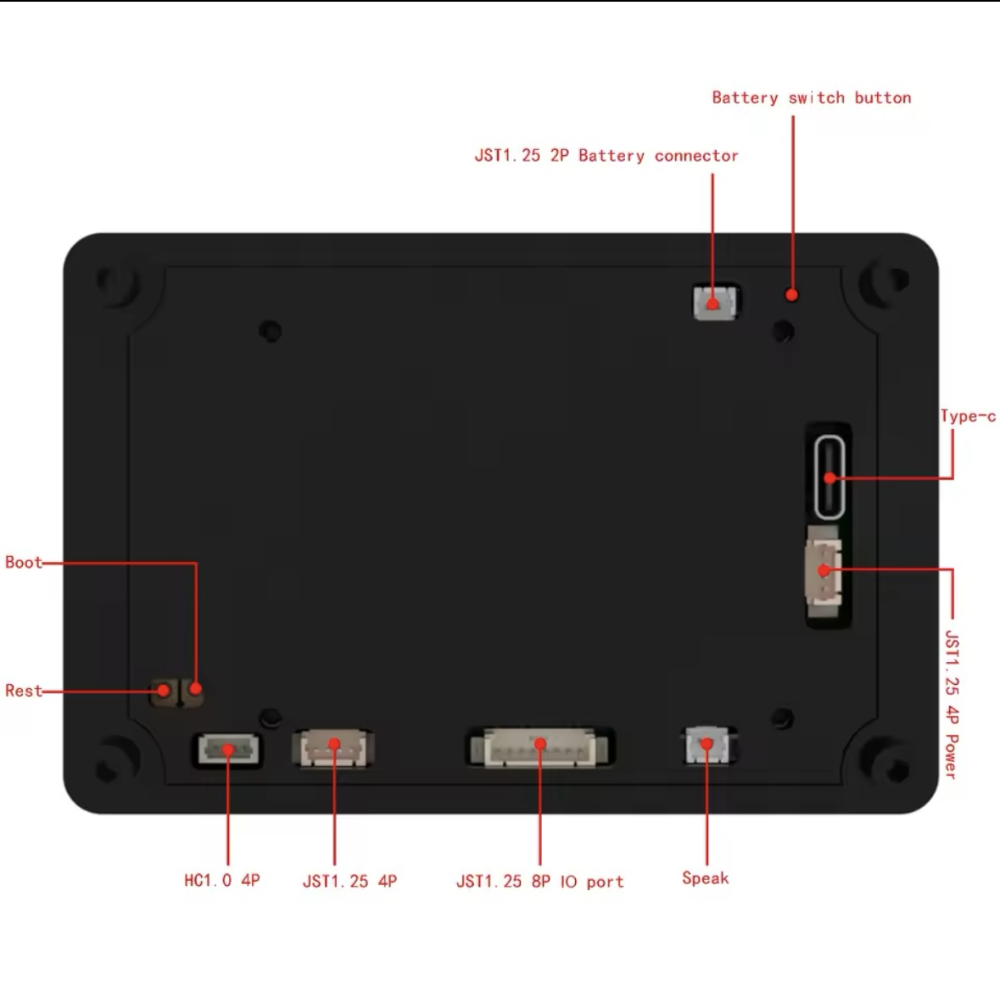

#WARCHILD CUSTOMS Custom UI

#The goal of this project will be a truck mounted touch screen in an automotive ESP-NOW network.

#Current Operation: Touch screen color picker commanding footwell lamps receiver esp32 over ESP-NOW.

#Future ideas: Running board lamps control via CANBUS signal lamp and doors, CANBUS shift warning lamp, CABBUS cargo lamp switch to control utility lamps. 

# This is a platformio based build of the JC3248W535EN DEMO_LVGL Package

For this board from https://s.click.aliexpress.com/e/_DFO5uIV
