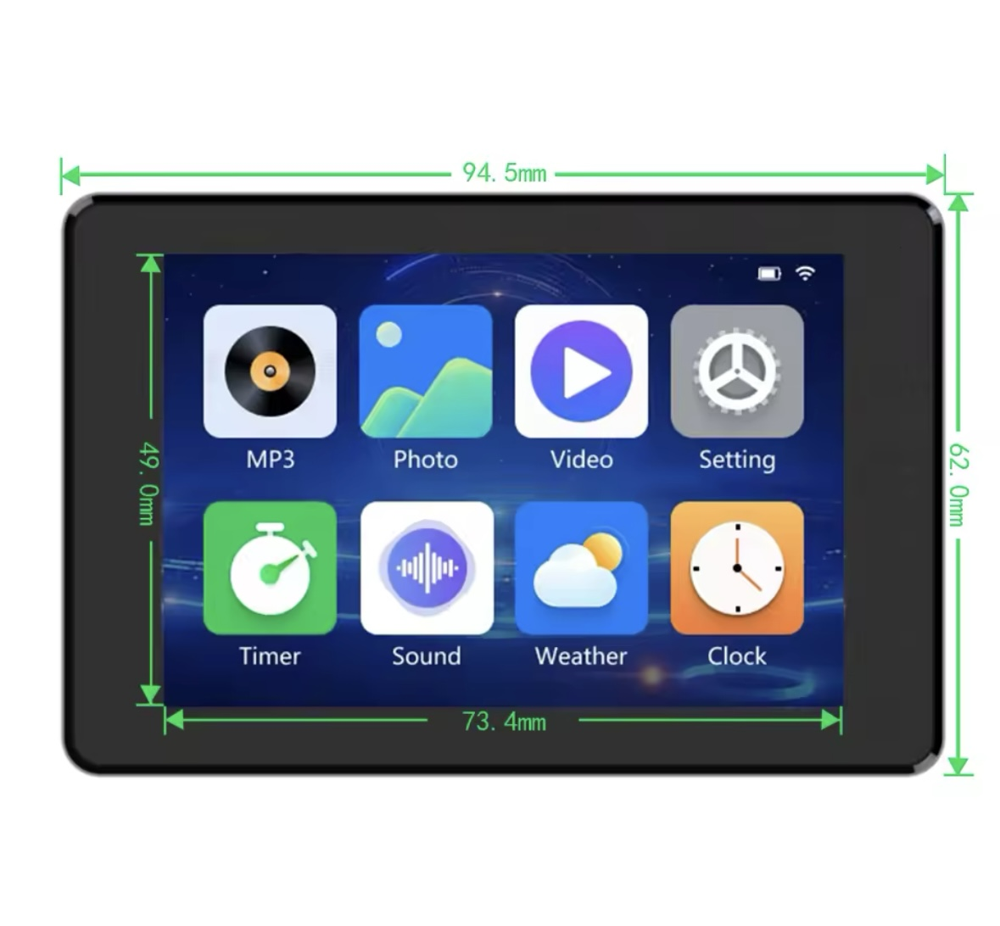

#WARCHILD CUSTOMS Cutom UI
#The goal of this project will be a truck mounted touch screen in an automotive ESP-NOW network.
#Ideas: running board lamps control via CANBUS signal lamp and doors, CANBUS shift lamp, touch screen control on footwell lighting, CABBUS cargo lamp switch to control utility lamps. 

# This is a platformio based build of the JC3248W535EN DEMO_LVGL Package

For this board from https://s.click.aliexpress.com/e/_DFO5uIV
